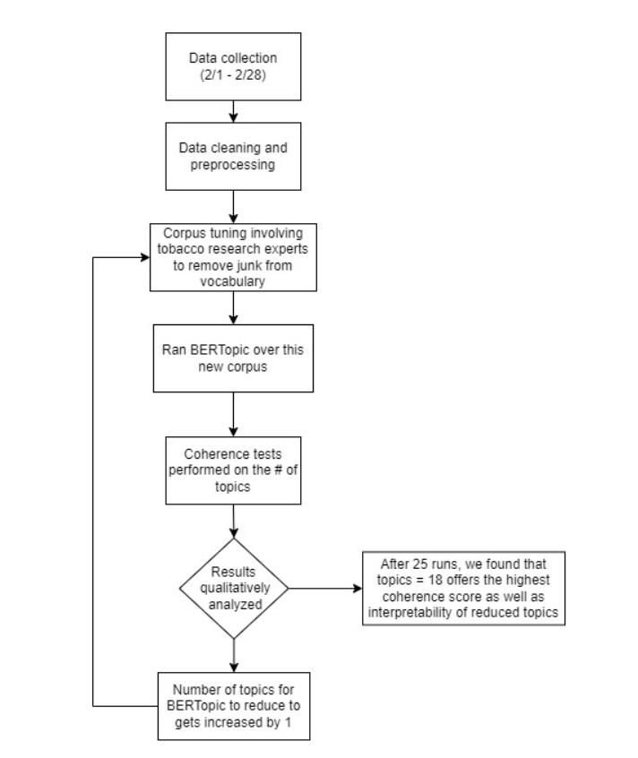

# BERT based Topic Modeling
BERT based Topic Modeling on TikTok descriptions to identify vaping trends: Made as a part of the Computational Media Lab

## Process
The following diagram is a nutshell of our evaluation procedure. Corresponding datasets and scripts are attached in this repository with more detailed instructions below.

## Data Collection

We collected data over several days using [this repository.](https://github.com/drawrowfly/tiktok-scraper). We then work on the description text collected by the scraper.
Storage details are WIP

## Data Preparation

We used 14 unique hashtags related to e-cigarettes (e.g., #vape, #vapelife, #vapenation) for data collection conducted in February 2022. The final analytic sample included 13,573 TikTok posts.

## Code

### Local

Please refer to [this repository.](https://github.com/MaartenGr/BERTopic) for setting up BERTopic library on your system.
We use deduplicate.py as a de-duplication script for videos that showed up multiple times on BERTopic TikTok data collection.
master_hashtags is a script used to create a master dataset of all the hashtags.
modeling is the main modeling script, I have the running of the model itself commented out but in those comments (line 46) is where you would change number of topics, use different models, etc. This also contains a class to run the coherence tests on different amount of BERTopic topic #'s. 
prebert This script goes through the TikTok descriptions and removes keywords based on whether or not they are present in the list in the script. 

